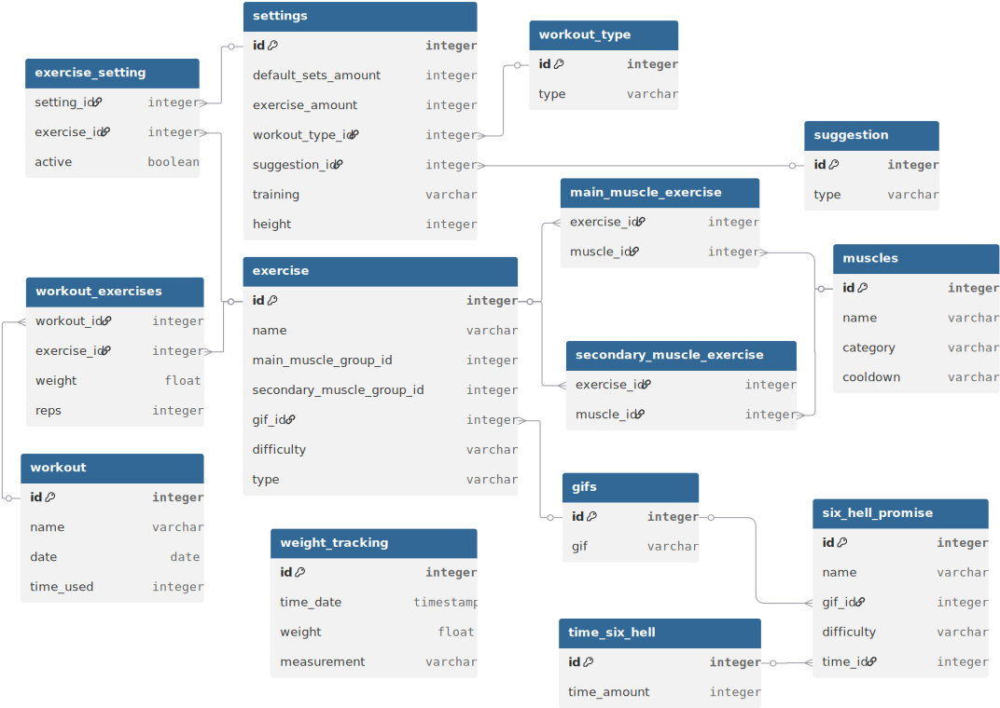

# GymTracker
An Android application that lets you track workouts easy, give recommended workout based on settings and earlier history and more

## Requirements
The application needs to help the used before, while and after a workout by letting a user quick start a gym session for that day, lets the user input exercise and weight used and lets the user see earlier progress and what muscles used.

The more specific requirements are as follows:
- Simple starting menu with 2-3 buttons where one is Quick start:
    - Quick start should use data from earlier data inputted within the last week or 2 and make a workout based earlier muscles used for less muscle fatigue and not to overwork a muscle.
    - The quick start should be based on settings of amount of workout exercises
    - Quick start should go towards more full body if not settings for it is made
- Settings 
    - amount of exercises each session
    - type of suggestion: No suggestion, Suggestion of same as last, suggestion of just above last time or progressive overload
    - Workout type: Fullbody, Upper/lower, Push/pull, Push/pull/lower
    - settings for six hell promise of tasks that you will allow
    - add new custom exercise 
- Storage
    - Store earlier workouts
    - store weight used to each exercise
    - Tasks:
        - Should store: 
            - task name
            - main muscles trained, and percentage of effectivity of the exercise if that data exists
            - other muscles that are lesser trained and percentage of effectivity of the exercise if that data exists
            - gif of exercises if found/exists
            - category - cardio, calisthenics/body weight
                - If its a body weight exercise then you should be able to have negative weight in the tracker
            - amount of sets (should be changed based on if user added or removed a set last time they workouted)
    - store a history of date/time and body weight when inputted
        - can add a "morning weight"/"evening weight categorization"
- Workout
    - Lets a user add amount of repetitions with what weight for a exercise
    - lets you add more sets, with a base of 3 sets
    - Drop set button?
    - variation button to see alternatives to a exercise
    - timer on top
    - Difficulty?
- Six hell promise
    - Random tasks that is for abs that one can do after a workout, between 5:30 to 9:00 minutes of pain
- Body weight recorder
- Need a showcase of muscles trained on a body

If the app is not overcrowded with functionalities, can then add a BMI calculator or like kcal burn approx calculator.
## Research 
Sources:
https://musclewiki.com/main_page
https://www.muscleandstrength.com/exercises
https://workout.cool/
https://github.com/omercotkd/exercises-gifs
https://www.kaggle.com/datasets/edoardoba/fitness-exercises-with-animations/data

Tasks information:
- Calf raises
- Barbell
    - Curl
    - Bench press
    - Front squat
    - Back Squat
    - Incline Row
    - Row
    - Lunge
    - Deadlift
- Dumbbell 
    - Curl
    - Hammer curl
    - Spider curl
    - Triceps extension
    - Arnold press
    - Incline Curl
    - Skullcrusher
    - Bulgarian Split Squat
    - Lateral Raise
    - Fly
    - Front Raise
    - Lunge
    - Preacher Curl
    - Press
    - Shrug
    - Goblet Squat
    - Wrist Curl
- Cable
    - Curl
    - Overhead extension
    - Pull down
    - Row
    - Bar:
        - Curl
        - pushdown 
        - Pullover
    - Crunch
    - Front Raise
    - Lateral Raise
    - Face away curl
- Rope
    - Overhead extension
    - Pushdown
- Cardio
    - Stairmaster
    - Treadmill - 0684.gif
    - Running - 0685.gif
    - Walking
    - Bouldering
    - Reverse treadmill
    - Row
- Body weight
    - Pull up
    - Dips
    - Push up
    - Squat
    - Reverse sit-up
    - Sit-up
    - Leg Raise
- Machine
    - Peck Deck
    - Delt fly
    - Leg extension
    - Leg curl
    - Hip Thrust
    - Row - 1350.gif
    - chest press
    - leg press
    - shoulder press
    - Hip Abductor
    - Hip Adductor
- Abs
    - Two up one down
    - Eight
    - Sisccor V-ups
    - 

Muscle group information:
- triceps:
    - Long head
    - Lateral head
    - Medial head
- biceps:
    - Long head
    - Short head
- fore arm 
- chest:
    - Upper chest 
    - Middle chest 
    - Lower chest
- upper back:
    - traps
- lower back
    - lats
- shoulder:
    - front delt
    - side delt
    - rear delt
- upper/lower abs
- obliques
- quads
- glutes
- hamstrings
- calves
- hip abductor muscle:
    - Gluteus medius
    - Gluteus minimus
## Data handling
My plan is to use SQLlite in the mobile application to store the data and show the data, so like a type of workouts gif, which muscle group it trains, settings and more.

### Values
- Exercise
    - Id
    - Name
    - Main muscle group ID
    - Secondary muscle group ID
    - Gif_ID
    - Difficulty
    - type (Body weight/machine/cable/weights)
- Muscles
    - Id
    - Name
    - Category
    - Cooldown (days)
- Main_Muscle_Exercise
    - Exercise_ID
    - Muscle_ID
- Secondary_Muscle_Exercise
    - Exercise_ID
    - Muscle_ID
- Gifs
    - Id
    - Gif (path, name or the gif itself?)
- Workout
    - ID
    - Name
    - Date
    - Time_used
    - Sets (derived from Workout_exercises?)
- Workout_exercises
    - Workout_ID
    - Exercise_ID
    - weight
    - reps
- Settings
    - id
    - Workout
        - Default sets amount
        - amount of exercises
        - type_ID (fullbody/)
        - Suggestion_ID (no suggestion/same as last time/just above last time/progressive overload for weights)
        - Training 
    - Height
- Exercise_setting
    - setting_id
    - exercise_id
    - active (bool)
- Workout_type
    - ID
    - Type
- Suggestion
    - ID
    - Type
- Weight_Tracking
    - id
    - time_date
    - weight
    - measurement (kg/lb)
- Six_hell_promise
    - id
    - name
    - gif_id
    - difficulty
    - time_id
- time_six_hell
    - id
    - time_amount (30 or 60 seconds)

## Design plan

## Implementation

